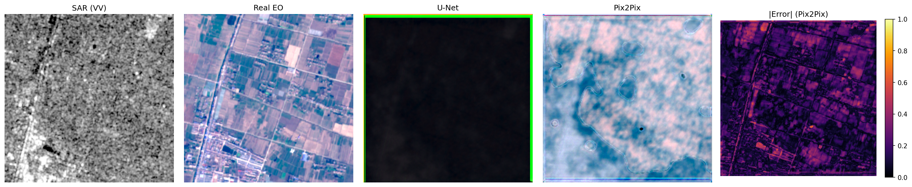

# SAR2EO-Diff

Translating Sentinel-1 SAR imagery into Sentinel-2-like optical imagery, using U-Net, Pix2Pix, and a from-scratch conditional diffusion model.

## Why

Radar (SAR) satellites can image the Earth through cloud cover and at night, but the output is hard to read — it looks nothing like a normal photo. Optical satellites give you something intuitive to look at, but they're blind whenever it's cloudy or dark, which is often exactly when you need the data most (flooding, wildfires, disaster response).

This project asks a simple question: can a model learn to translate SAR into something that looks like optical imagery, while staying geographically accurate rather than just visually convincing? It's built around SEN12MS, a public dataset of paired Sentinel-1/Sentinel-2 patches.

## What's here

Three models, trained and evaluated on the same data:

- **U-Net** — a plain encoder-decoder trained with L1 loss. The floor: what you get with pure pixel regression and no notion of "does this look real."
- **Pix2Pix** — the same generator backbone, plus a PatchGAN discriminator and adversarial loss. Tests whether adversarial training buys you anything over plain regression.
- **Conditional diffusion** — a lightweight DDPM conditioned on the SAR image, implemented from scratch (not a wrapped Stable Diffusion). Tests whether iterative denoising beats a single-shot GAN generator.

A fourth piece — diffusion with a semantic-consistency loss, using a segmentation network to check that generated imagery preserves land-cover structure and not just visual plausibility — is implemented in code but not yet trained (see Status below).

## Results so far

Evaluated on held-out validation patches:

| Model | PSNR | SSIM | LPIPS |
|---|---|---|---|
| U-Net | 19.61 | 0.881 | 0.392 |
| Pix2Pix | **25.62** | 0.878 | **0.289** |
| Diffusion | not yet — undertrained, see notes below | | |

Pix2Pix beats the U-Net baseline on every metric except SSIM (essentially tied). What's more interesting is *how* it got there: the discriminator collapsed early in training — its loss dropped to near-zero within the first epoch while the generator's adversarial loss climbed for the rest of training, meaning the adversarial signal was mostly uninformative after that point. Despite this, the generator still outperformed the plain-L1 baseline on every image-quality metric. Worth digging into further; a controlled ablation (same generator, adversarial loss on vs. off) would help pin down why, but hasn't been run yet.

The diffusion model trains cleanly — loss drops steadily with no divergence — but hasn't had enough training time yet to generate valid-quality samples from pure noise. It does show real learned structure when tested in a partial-denoising setting (starting from a lightly-noised real image rather than pure noise), which confirms the model has learned something real about the SAR/EO relationship, just not enough yet for full from-scratch generation.

### Qualitative example



Left to right: input SAR, real EO (ground truth), U-Net output, Pix2Pix output, and the per-pixel error map for Pix2Pix. On this patch (agricultural fields with visible boundaries), U-Net's output is still nearly flat/undertrained, while Pix2Pix has clearly picked up on the real field structure and boundaries from the SAR input — the color palette is off (washed-out blue/pink rather than the real greens and browns) and fine detail is missing, but the spatial layout is recognizably correct. The error map confirms this: error concentrates along the same field boundaries visible in the real image rather than appearing as random noise, which suggests the model has learned real structure and just hasn't converged on color accuracy yet.

Full write-up, including the complete failure analysis, is in [`docs/results_today.md`](docs/results_today.md).

## Problems hit along the way (and how they were solved)

This project went through more debugging than a typical "clean" pipeline, worth documenting honestly since it's part of the actual work:

- **The Kaggle dataset mirror doesn't match the standard SEN12MS layout.** The version used here (`sen12ms-asia`) ships as pre-cropped 256×256 PyTorch tensor shards (`shard_XXX.pt`), not the original GeoTIFF/ROI folder structure most SEN12MS code assumes. Required writing a custom `ShardedSEN12MSDataset` loader from scratch, including reverse-engineering the actual value ranges from the data itself (SAR and EO here don't follow standard physical unit ranges — normalization constants were derived empirically, not assumed).
- **One of the 14 shards is corrupted/truncated** (a third of the expected file size) and fails to load. The loader now detects and skips unreadable shards automatically rather than crashing.
- **Default random shuffling thrashes badly against sharded data.** Each shard is ~1.5GB; naive global shuffling forces a full shard reload on almost every sample. Fixed with a custom `ShardAwareSampler` that shuffles shard order and within-shard order separately, keeping I/O local.
- **Pix2Pix discriminator collapse**, as described above — the fix applied is label smoothing on the discriminator's real-image target, a standard mitigation, though the deeper "why did Pix2Pix still win despite this" question is still open.
- **A display bug made real, non-broken model outputs look like solid black images.** Linear min-max stretching plus the actual (narrow, low-reflectance) value range of some scenes was collapsing everything toward zero. Fixed with a percentile stretch plus gamma correction for dim scenes.
- **Kaggle free-tier GPU time is a real constraint.** Full convergence for all three models is estimated at 20–30 GPU-hours; free-tier Kaggle gives about 30 hours/week with session limits well under that per sitting. Current results reflect a time-constrained pass sized to what was actually available, with training designed to checkpoint every epoch and resume automatically across sessions.

## Status

Working and evaluated: data pipeline, U-Net, Pix2Pix.
Working but undertrained: conditional diffusion (mechanism confirmed, needs more training for full generation quality).
Implemented but not yet trained: semantic-consistency loss (needs a pretrained segmentation network first).
Not yet done: full-scale training across all models, FID and mIoU metrics, a proper held-out test set, polarization ablation.

`docs/results_today.md` has the most current numbers and full failure analysis — this README will lag behind as training continues.


## Project Structure

```text
SAR2EO-Diff/
├── configs/            # YAML configs for each model (no hard-coded hyperparameters)
├── src/
│   ├── data/            # dataset, preprocessing, paired augmentations
│   ├── models/           # unet, pix2pix, diffusion, segmentation
│   ├── training/         # per-model training loops
│   ├── evaluation/        # metrics, evaluation loop, visualization
│   └── utils/             # seed, checkpoint, experiment logger
├── notebooks/            # 01-08, Kaggle-run, import from src/
├── scripts/              # thin CLI entry points (prepare_data / train / evaluate)
├── tests/                # pytest unit tests (data, models, metrics)
├── results/               # figures / tables / qualitative outputs (gitignored binaries)
├── checkpoints/            # model weights (gitignored)
└── docs/                    # methodology, experiment log, research notes, final report
```

## Running it

Locally, for setup and code changes:

```bash
python -m venv venv
source venv/bin/activate      # venv\Scripts\activate on Windows
pip install -r requirements.txt
python -m pytest tests/ -v     # sanity check, no dataset needed
```

Actual training runs on Kaggle (needs a GPU and the dataset attached):

```python
!git clone https://github.com/<your-username>/SAR2EO-Diff.git
%cd SAR2EO-Diff
!pip install -r requirements.txt
!python -m src.training.train_unet --config configs/baseline_unet.yaml
```

Swap in `configs/pix2pix.yaml` or `configs/diffusion.yaml` for the other two. All three checkpoint every epoch and resume automatically if a checkpoint already exists, so a long training run can be split across multiple Kaggle sessions without losing progress.

To evaluate a trained checkpoint:

```python
!python -m scripts.evaluate --config configs/baseline_unet.yaml \
    --checkpoint checkpoints/unet/best.pt \
    --output results/tables/unet_test_metrics.json --split val
```

## Dataset

[SEN12MS](https://mediatum.ub.tum.de/1474000) — paired Sentinel-1 SAR and Sentinel-2 optical patches, plus MODIS land-cover labels. This project uses a Kaggle mirror (`sen12ms-asia`) packaged as pre-cropped tensor shards rather than the original GeoTIFF format — see `src/data/sharded_dataset.py` for the loader written specifically for this format. Currently using a 3-channel SAR input and 3-channel RGB EO output; the full 13-band Sentinel-2 output is on the future-work list.

## Limitations

Single free-tier GPU, so everything is patch-level (256×256), not full-scene. Current results come from a reduced-scale pass built to prove the pipeline end-to-end and get an honest first read on relative model performance — not a fully-converged result. SAR-to-optical is also fundamentally an imperfect mapping: SAR and optical sensors measure physically different things, so no model will produce a pixel-perfect reconstruction, only a plausible and hopefully geographically faithful one.

## What's next

Full-scale training for all three models, semantic-consistency training once a segmentation network is pretrained, a proper held-out test set with FID and mIoU, and an ablation on SAR polarization/channel choice.

